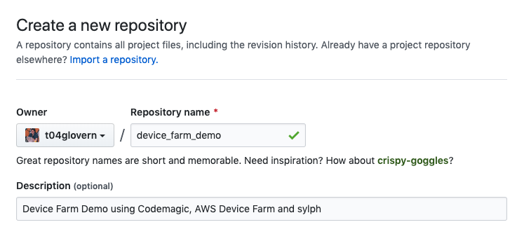

# Flutter CI/CD with Codemagic, Slyph & AWS Device Farm

## Requirements

* [Flutter installed](https://flutter.dev/docs/get-started/install) and up to date
* AWS Account and [credentials setup for CLI access](https://docs.aws.amazon.com/cli/latest/userguide/cli-chap-configure.html)

## Create Flutter Project

We'll start off by creating a new Flutter project that can be used for this demo. I've used VSCode to perform this step. We'll be stting up just enough in order to builld for Android & iOS.


**NOTE**: *If you are performing this step manually, run the following commands instead:*

```bash
mkdir device_farm_demo && cd device_farm_demo
flutter create --ios-language swift --android-language kotlin .
```

## Run Flutter Project

Before doing anything, we should first check to ensure that Flutter builds and runs for each device type locally. Follow the steps below to run the application for each device type.

You can list the available emulators by running the following command:

```bash
flutter emulators
```

### iOS Run

**NOTE**: *You will first need to setup Xcode and [create a new Simulator by following the offical guide](https://flutter.dev/docs/get-started/install/macos#install-xcode)*

If you are on MacOS you can test locally using the simulator by running the following:

```bash
open -a Simulator
flutter run
```

### Android Run

**NOTE**: *You will first need to [setup Android Studio and a Virtual device by following the offical guide](https://flutter.dev/docs/get-started/install/macos#install-android-studio)*

Open up a virtual device and run with the following command:

```bash
flutter run
```

## Push Flutter Project

We're making use of [Codemagic CI/CD](https://blog.codemagic.io/) for the automated integration and deployment of our Flutter project. Because of this we'll have to push our repository to a source control provider like GitHub that will be monitored and acted on when we make changes to the repository.

Create a new repository from the [following page](https://github.com/new)



Next push the local source code up to this new repository by running the following (ensuring to substitute in your own details).

```bash
git init
git remote add origin git@github.com:t04glovern/device_farm_demo.git
git add .
git commit -m "init"
git push -u origin master
```

## Codemagic Setup

Before diving into device farm we should also ensure that the current Flutter app builds okay on Codemagic. Once this is confirmed we'll be able to iterate faster while we're learning. You can access Codemagic at [https://codemagic.io/apps](https://codemagic.io/apps).

Sign in with your account (preferably GitHub since we've already pushed our project there). Once signed in import the new repoistory as a Codemagic project.
