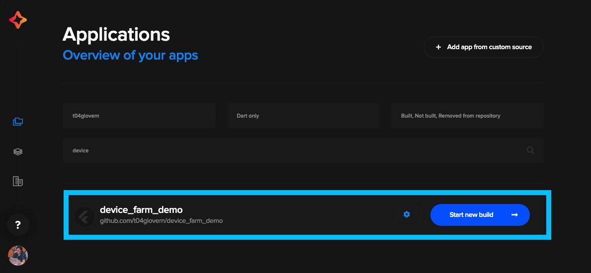
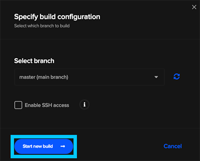
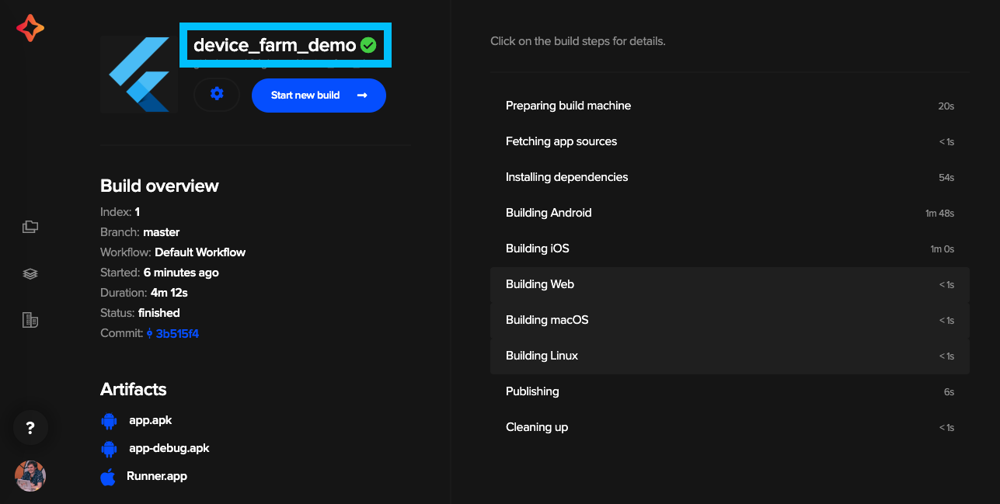
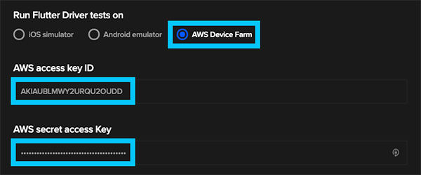
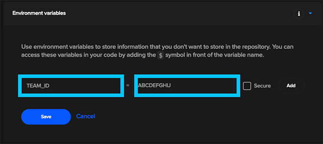
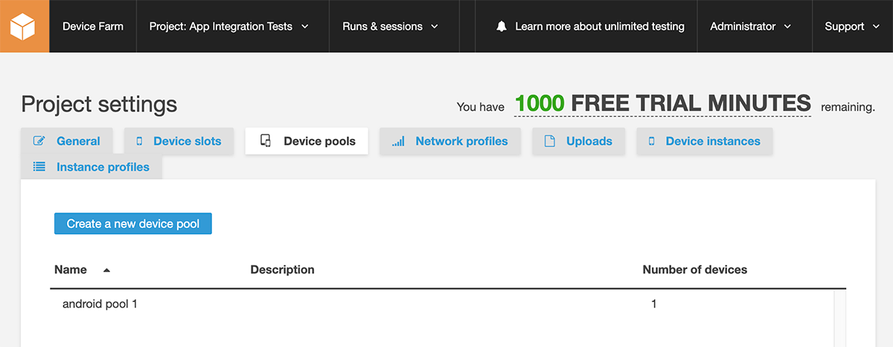
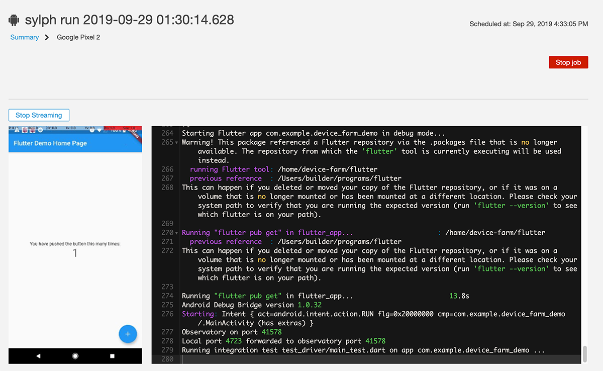

# Flutter CI/CD with Codemagic, Sylph & AWS Device Farm

A common problem with developing for mobile is the sheer variety of device options that have to be tested for when designing UI. Traditionally teams might have had a set of different mobile devices that could be used to verify a consistent expereience however without automation this QA process is easy to ignore.

In this post we're going to look at a recent feature that [Codemagic](https://codemagic.io) has begun to offer that allows automated integration testing of mobile devices to be baked into CI/CD pipelines. The feature is built ontop of [Sylph](https://github.com/mmcc007/sylph) which is a Flutter specific toolchain for orchestrating [AWS Device Farm](https://aws.amazon.com/device-farm/).

## Requirements

* [Flutter installed](https://flutter.dev/docs/get-started/install) and up to date
* AWS Account and [credentials setup for CLI access](https://docs.aws.amazon.com/cli/latest/userguide/cli-chap-configure.html)

## Create Flutter Project

We'll start off by creating a new Flutter project that can be used for this demo. I've used VSCode to perform this step. We'll be stting up just enough in order to builld for Android & iOS.


**NOTE**: *If you are performing this step manually, run the following commands instead:*

```bash
mkdir device_farm_demo && cd device_farm_demo
flutter create --ios-language swift --android-language kotlin .
```

## Run Flutter Project

Before doing anything, we should first check to ensure that Flutter builds and runs for each device type locally. Follow the steps below to run the application for each device type.

You can list the available emulators by running the following command:

```bash
flutter emulators
```

### iOS Run

**NOTE**: *You will first need to setup Xcode and [create a new Simulator by following the offical guide](https://flutter.dev/docs/get-started/install/macos#install-xcode)*

If you are on MacOS you can test locally using the simulator by running the following:

```bash
open -a Simulator
flutter run
```

### Android Run

**NOTE**: *You will first need to [setup Android Studio and a Virtual device by following the offical guide](https://flutter.dev/docs/get-started/install/macos#install-android-studio)*

Open up a virtual device and run with the following command:

```bash
flutter run
```

## Push Flutter Project

We're making use of [Codemagic CI/CD](https://blog.codemagic.io/) for the automated integration and deployment of our Flutter project. Because of this we'll have to push our repository to a source control provider like GitHub that will be monitored and acted on when we make changes to the repository.

Create a new repository from the [following page](https://github.com/new)


Next push the local source code up to this new repository by running the following (ensuring to substitute in your own details).

```bash
git init
git remote add origin https://github.com/t04glovern/device_farm_demo.git
git add .
git commit -m "init"
git push -u origin master
```

## Codemagic Setup

Before diving into device farm we should also ensure that the current Flutter app builds okay on Codemagic. Once this is confirmed we'll be able to iterate faster while we're learning. You can access Codemagic at [https://codemagic.io/apps](https://codemagic.io/apps).

Sign in with your account (preferably GitHub since we've already pushed our project there). Once signed in import the new repoistory as a Codemagic project.



You will be prompted to select a branch, simply leave it on master and click `Start new build`.



The build could take up to 5 minutes to complete as it builds for both iOS and Android by default. Once successful you'll see a green tick and we can safely move on.



## Sylph Introduction

[Sylph](https://github.com/mmcc007/sylph) is a wrapper around AWS Device farm that helps run integration tests for Flutter projects. It orchestrates device farm instances (both Android & iOS) that will run the Flutter code we push to it.

### flutter_driver dependency

The flutter_driver package is going to be required in order to test our project on emulated hardware automatically. To install this dependency to the project add the following to the `dev_dependencies` section of the `pubspec.yaml` file

```yaml
dev_dependencies:
  flutter_test:
    sdk: flutter
  flutter_driver:
    sdk: flutter
  test: ^1.5.2
```

#### test_driver setup

There also has to be `test_driver` configurations added to the repository that define what interactions should take place on the emulator. To do this create a new folder and two sub files

```bash
> test_driver
    - main_test.dart
    - main.dart
```

Add the following to the files:

##### main_test.dart

```dart
import 'package:flutter_driver/flutter_driver.dart';
import 'package:test/test.dart';

void main() {
  group('end-to-end test', () {
    FlutterDriver driver;

    setUpAll(() async {
      // Connect to a running Flutter application instance.
      driver = await FlutterDriver.connect();
    });

    tearDownAll(() async {
      if (driver != null) await driver.close();
    });

    test('tap on the floating action button; verify counter', () async {
      // Finds the floating action button (fab) to tap on
      SerializableFinder fab = find.byTooltip('Increment');

      // Wait for the floating action button to appear
      await driver.waitFor(fab);

      // Tap on the fab
      await driver.tap(fab);

      // Wait for text to change to the desired value
      await driver.waitFor(find.text('1'));
    });
  });
}
```

##### main.dart

```dart
import 'package:device_farm_demo/main.dart';
import 'package:flutter/material.dart';
import 'package:flutter_driver/driver_extension.dart';

void main() {
  // Enable integration testing with the Flutter Driver extension.
  // See https://flutter.io/testing/ for more info.
  enableFlutterDriverExtension();
  runApp(MyApp());
}
```

### Sylph Example Configuration

There's a very good example in the [Sylph repository](https://github.com/mmcc007/sylph#configuration) that we'll be tweaking for this demo.

Create a new file in the root of the `device_farm_demo` project called `sylph.yaml`. Add the following contents to the file

```yaml
# sylph config
tmp_dir: /tmp/sylph
artifacts_dir: /tmp/sylph_artifacts
# local timeout per device farm run
sylph_timeout: 720 # seconds approx
# run on ios and android pools concurrently (for faster results)
concurrent_runs: true

# device farm config
project_name: App Integration Tests
default_job_timeout: 10 # minutes, set at project creation

device_pools:

  - pool_name: android pool 1
    pool_type: android
    devices:
      - name: Google Pixel 2
        model: Google Pixel 2
        os: 8.0.0

  - pool_name: ios pool 1
    pool_type: ios
    devices:
      - name: Apple iPhone X
        model: A1865
        os: 11.4

test_suites:

  - test_suite: example tests 1
    main: test_driver/main.dart
    tests:
      - test_driver/main_test.dart
    pool_names:
      - android pool 1
      - ios pool 1
    job_timeout: 15 # minutes, set per job, over-rides default job timeout above
```

The contents of this file define the two device pools, one for iOS and the other for Android. Then it defines a test suite where it attaches the device pools to tests that should be run on the devices.

**NOTE**: If you don't have a valid Apple Developer subscription you'll have to remove the iOS device pool. You can do so by commenting them out.

```yaml
device_pools:

  # - pool_name: ios pool 1
  #   pool_type: ios
  #   devices:
  #     - name: Apple iPhone X
  #       model: A1865
  #       os: 11.4

...

pool_names:
  - android pool 1
  # - ios pool 1
```

With all the required code now in the project, you can push the changed by running the following:

```bash
git add .
git commit -m "added sylph and test_driver"
git push
```

## AWS Device Farm

AWS Device Farm is a service where real devices are exposed for you to run integration tests in life like scenarios. The service itself is only available in Oregon region (us-west-2).

### AWS Authentication

To authenticate with AWS Device Farm we'll have to create a new user with the correct permission scope. This is important esspecially since we are going to be putting these credentials in Codemagic and don't want to over privilage them.

I've created a nice CloudFormation template that can be used to create a `User`, `Group` and `Policy` with the appropriate permission set attached. More information about the scope can be found on the [offical documentation page](https://docs.aws.amazon.com/devicefarm/latest/developerguide/setting-up.html)

Create a folder called `aws` and add a file to it called `device_farm_user.yaml` with the following contents

```yaml
AWSTemplateFormatVersion: '2010-09-09'

Parameters:
  Password:
    NoEcho: 'true'
    Type: String
    Description: New account password
    MinLength: '1'
    MaxLength: '41'
    ConstraintDescription: the password must be between 1 and 41 characters

Resources:
  DeviceFarmUser:
    Type: AWS::IAM::User
    Properties:
      LoginProfile:
        Password: !Ref 'Password'
  DeviceFarmAdminGroup:
    Type: AWS::IAM::Group
  Admins:
    Type: AWS::IAM::UserToGroupAddition
    Properties:
      GroupName: !Ref 'DeviceFarmAdminGroup'
      Users: [!Ref 'DeviceFarmUser']
  DeviceFarmAccessPolicy:
    Type: AWS::IAM::Policy
    Properties:
      PolicyName: DeviceFarmList
      PolicyDocument:
        Statement:
        - Effect: Allow
          Action: ['devicefarm:*']
          Resource: '*'
      Groups: [!Ref 'DeviceFarmAdminGroup']
  DeviceFarmKeys:
    Type: AWS::IAM::AccessKey
    Properties:
      UserName: !Ref 'DeviceFarmUser'

Outputs:
  AccessKey:
    Value: !Ref 'DeviceFarmKeys'
    Description: AWSAccessKeyId of new user
  SecretKey:
    Value: !GetAtt [DeviceFarmKeys, SecretAccessKey]
    Description: AWSSecretAccessKey of new user
```

Deploy the template by running the following command:

```bash
aws cloudformation create-stack \
  --stack-name iam-devicefarm-user \
  --template-body file://aws/device_farm_user.yaml \
  --parameters ParameterKey=Password,ParameterValue=$(openssl rand -base64 30) \
  --capabilities CAPABILITY_IAM
```

Retrieve the generated AWS Credentials by running the following two commands for each part of the set. **Keep these values private**

```bash
# Get AWS Access Key ID
aws cloudformation describe-stacks --stack-name iam-devicefarm-user \
  --query 'Stacks[0].Outputs[?OutputKey==`AccessKey`].OutputValue' \
  --output text

# Get AWS Secret Access Key
aws cloudformation describe-stacks --stack-name iam-devicefarm-user \
  --query 'Stacks[0].Outputs[?OutputKey==`SecretKey`].OutputValue' \
  --output text
```

## Codemagic Device Farm Setup

Finally we're able to setup Codemagic to use the credentials we just created to launch AWS Device Farm instances. Head back to Codemagic and go to the Settings page of the `device_farm_demo` project

Expand the `test` step and select `AWS Device Farm` as the location in which to run the tests. Add the two secrets from the previous step to the boxes below that



### iOS Build Environment [Optional]

For iOS builds you will also need to specify your Developer Portal Team ID. This can be found in the [https://developer.apple.com/account/#/membership](https://developer.apple.com/account/#/membership) console.

Once you have retrieved your Developer Portal Team ID, create an Environment variable under the Codemagic settings for the `device_farm_demo` project:

* **TEAM_ID**: ABCDEFGHIJ



## Codemagic Run Build

Upon running a new build after setting up AWS Device Farm, Codemagic will use Sylph in order to create new devices on AWS to test against.

You can follow the progress either out of the Codemagic UI, or if you're interested in what's happening under the hood; navigate to the [Device Farm console](https://us-west-2.console.aws.amazon.com/devicefarm/home)



You should see the device pool we defined in the `sylph.yaml` file from earlier. You are also able to dig down into the test suite job Codemagic created for us as well.



Once the build completes you can view the status easily out of the Codemagic, or alternatively you can view the status in AWS Device Farm also.

## Cleanup AWS

If you no longer want the user account / policy that we created earlier on in this post, you can:

* Delete the CloudFormation stack from the [CloudFormation console directly](https://console.aws.amazon.com/cloudformation/home)
* Run the following command

  ```bash
  aws cloudformation delete-stack \
    --stack-name iam-devicefarm-user
  ```
